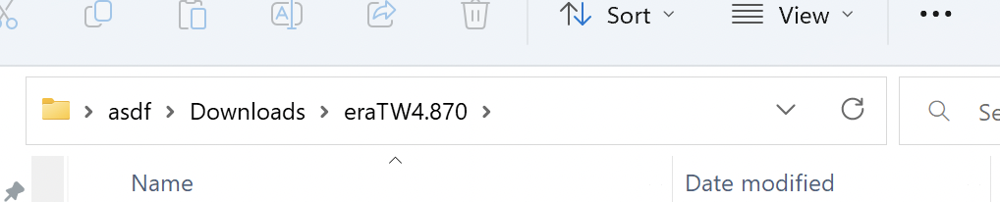
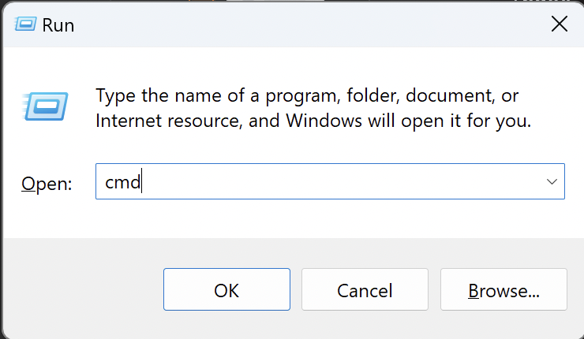
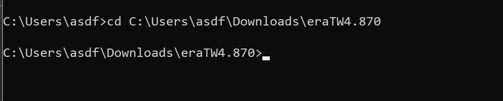
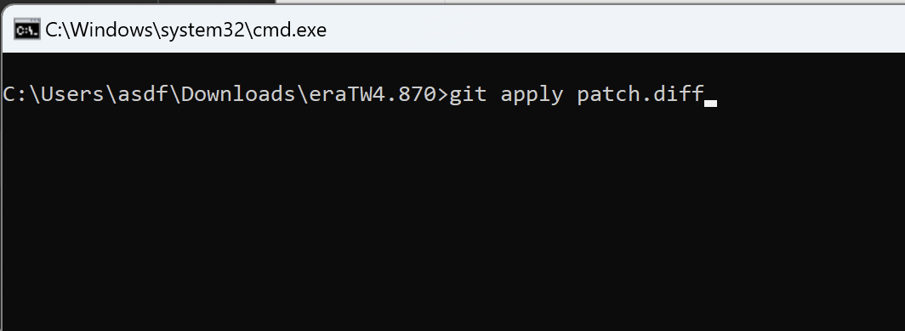

# README

## 패치 적용 방법

### 1. Git을 이용하여 적용

1. Git을 미리 설치해야함

2. 원하는 패치의 `*.diff` 파일을  `ERB`, `CSV`가 있는 디렉토리에 다운로드; ***`ERB`, `CSV`의 안이 아님***

3. 터미널을 실행하여 해당 디렉터리로 이동

   1. 파일 탐색기에서 경로를 복사

      

   2. `Window` + `R`를 누르고 나오는 창에 `cmd` 입력하고 엔터

      

   3. `cd (방금 복사한 경로 붙여넣기)` 후 엔터

      

4. `git apply *.diff` 실행 (`*.diff`는 실제 파일의 이름으로 바꿔야 함)

   

### 2. 직접 코드를 복사하여 적용

원하는 패치의 디렉터리 내부를 모두 복사 후 TW 실행 파일이 있는 디렉터리에 붙여넣기, `*.diff` 파일들은 사용하지 않으니 삭제해도 무방